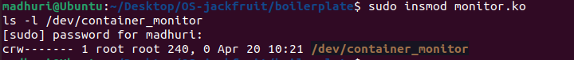
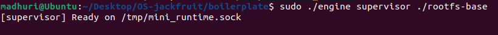
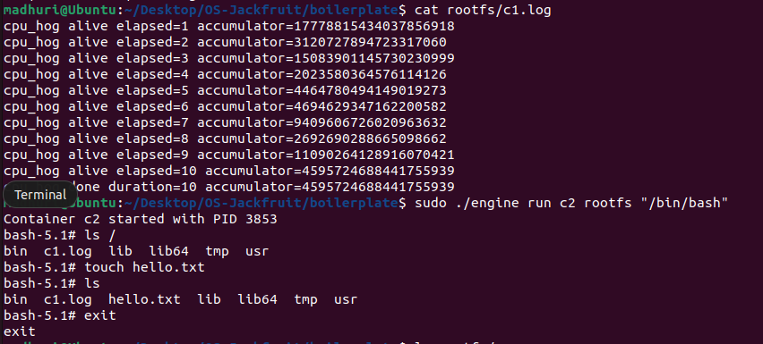
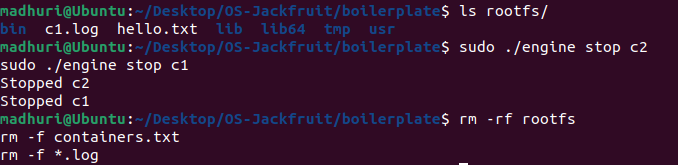
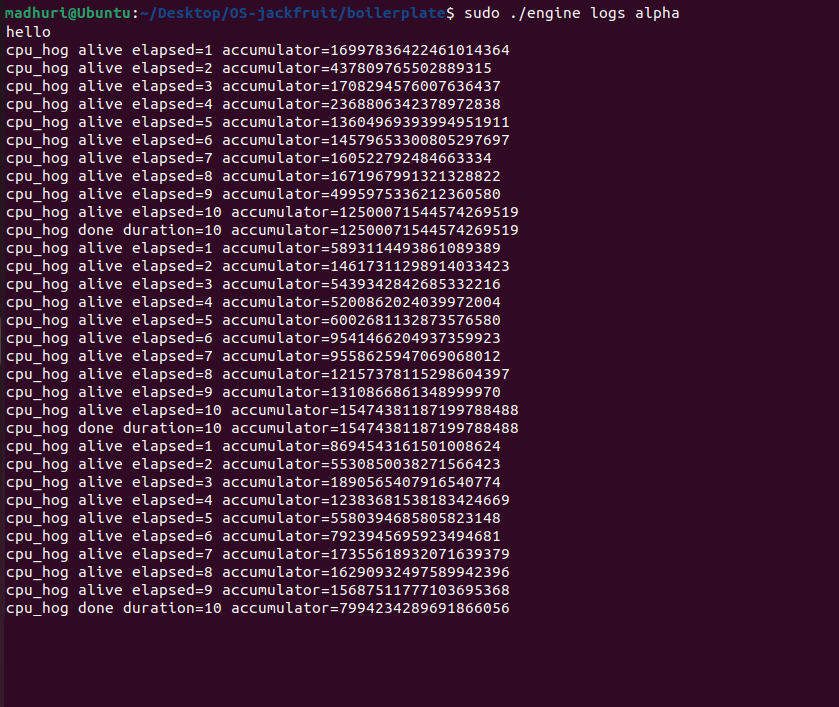
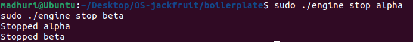
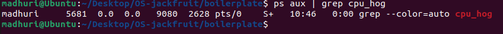
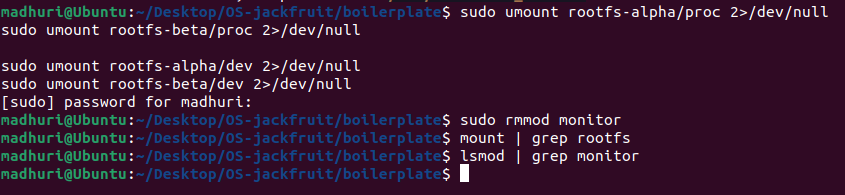

# OS-Jackfruit: Multi-Container Runtime

## Team Information

* Name: Madhuri Ravi
        Manasvi GV
* Course: Operating Systems Project

---

## Project Summary

This project implements a lightweight container runtime in C that can run and manage multiple containers simultaneously. Each container is isolated using a separate root filesystem and executes workloads independently. The system also integrates a kernel module to monitor container activity.

---

## Features Implemented

* Multi-container execution (run multiple containers concurrently)
* Container lifecycle management (start, stop, list)
* Process isolation using `chroot`
* Logging of container output
* Kernel module integration (`/dev/container_monitor`)
* Workload execution (CPU-bound program: `cpu_hog`)

---

## Build Instructions

```bash
cd boilerplate
make clean
make
```

---

## Load Kernel Module

```bash
sudo insmod monitor.ko
ls -l /dev/container_monitor
```

---

## Setup Root Filesystem

```bash
mkdir rootfs-base
tar -xzf alpine-minirootfs-3.20.3-x86_64.tar.gz -C rootfs-base

cp -a rootfs-base rootfs-alpha
cp -a rootfs-base rootfs-beta
```

Create required directories:

```bash
mkdir -p rootfs-alpha/proc rootfs-beta/proc
mkdir -p rootfs-alpha/dev rootfs-beta/dev
```

Mount:

```bash
sudo mount -t proc proc rootfs-alpha/proc
sudo mount -t proc proc rootfs-beta/proc

sudo mount --bind /dev rootfs-alpha/dev
sudo mount --bind /dev rootfs-beta/dev
```

---

## Running the System

### Start Supervisor

```bash
sudo ./engine supervisor ./rootfs-base
```

### Start Containers (in another terminal)

```bash
cp cpu_hog rootfs-alpha/
cp cpu_hog rootfs-beta/

sudo ./engine start alpha ./rootfs-alpha /cpu_hog
sudo ./engine start beta ./rootfs-beta /cpu_hog
```

---

## List Running Containers

```bash
sudo ./engine ps
```

---

## View Logs

```bash
sudo ./engine logs alpha
```

---

## Stop Containers

```bash
sudo ./engine stop alpha
sudo ./engine stop beta
```

---

## Cleanup

Stop supervisor (Ctrl + C), then:

```bash
sudo umount rootfs-alpha/proc
sudo umount rootfs-beta/proc
sudo umount rootfs-alpha/dev
sudo umount rootfs-beta/dev

sudo rmmod monitor
```

---

## Demo Screenshots

The following screenshots demonstrate the working system:

1. Kernel module loaded (`/dev/container_monitor`)
   
   
   
2. Supervisor running
   
   
   
3. Starting multiple containers
   
   
   
5. Container metadata using `ps`
   
   
   
6. Logging output (`cpu_hog`)
    
    
   
7. Stopping containers
    
    
    
    
    
8. Clean teardown (no running processes)
    
    

---

## Key Concepts Demonstrated

### Process Isolation

Each container runs in an isolated filesystem using `chroot`, ensuring separation from the host system.

### Container Management

A central supervisor manages multiple containers and tracks their lifecycle.

### Logging

Container output is captured and stored, allowing inspection via CLI commands.

### Kernel Interaction

A kernel module provides monitoring support via a device interface.

---

## Workload Used

* `cpu_hog`: CPU-intensive program used to simulate container workload and generate logs.

---

## Conclusion

This project demonstrates a simplified container runtime with multi-container support, logging, and kernel interaction. It provides a practical understanding of process isolation, system calls, and operating system internals.

---
